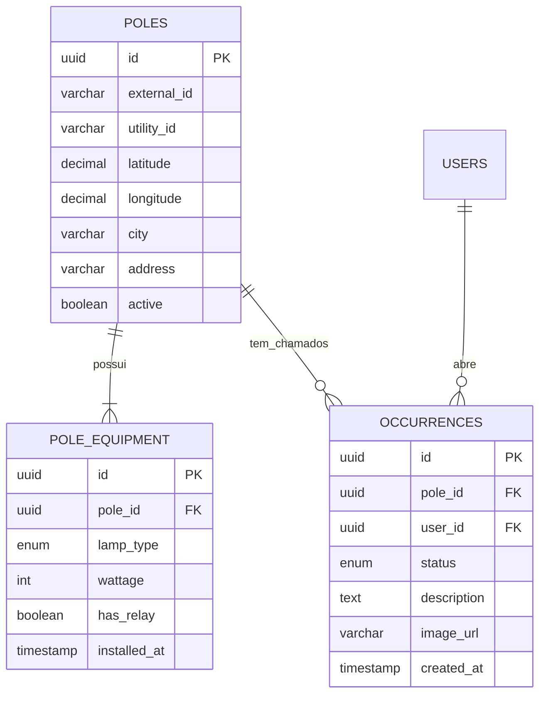

# 🏛️ Modelo de Domínio & Dados (ERD)

Isso não é o diagrama de entidade e relacionamento, só fiz alguns pensamentos sobre, não necessáriamente vai fucar assim mas fiz alguma coisa

**Inclusive, é literalmente tabelas já existentes, temos que estruturar outras para as telas do operador, dashboard e usuário.**

---

## 1. Entidades Principais

### 📍 Tabela: ``streetLights``
*Representa o ativo físico imobilizado. É a âncora geográfica do sistema.*

| Coluna | Tipo (SQL) | Obrigatório | Origem CSV | Descrição |
| :--- | :--- | :--- | :--- | :--- |
| **`id`** | `UUID` | Sim | *(Gerado)* | Chave Primária (PK). |
| `external_id` | `VARCHAR` | **Sim (Unique)** | `ID_IP` | O número pintado no poste ("plaquinha"). Importante. |
| `utility_id` | `VARCHAR` | Sim | `ID_POSTE` | ID interno da Energisa. |
| `latitude` | `DECIMAL(10,8)`| Sim | `LATITUDE` | Coordenada Y.  |
| `longitude` | `DECIMAL(10,8)`| Sim | `LONGITUDE` | Coordenada X. |
| `city` | `VARCHAR` | Sim | `CIDADE` | Palmicity primeiramente, mas já deixar preparado para outras. |
| `group_unit` | `INTEGER` | Não | `UC_AGRUPADORA` | Identifica o circuito elétrico. Útil para apagões. |
| `address` | `VARCHAR` | Não | *(Vazio)* | Logradouro. Será preenchido via **Reverse Geocoding API**. |
| `neighborhood`| `VARCHAR` | Não | *(Vazio)* | Bairro. Será preenchido via **Reverse Geocoding API**. |
| `active` | `BOOLEAN` | Sim | *(Default: true)* | Soft Delete. Nunca apagamos um poste fisicamente do banco. |

OBS: mas oq seria o **Reverse Geocoding API**, é o que relamente vai trazer o endereço pra gente.

---

### 💡 Tabela: `streetLight_equipment` (Equipamentos)
*Representa o que está instalado no topo do poste. É aqui que sabemos o consumo e o tipo de manutenção.*

| Coluna | Tipo (SQL) | Obrigatório | Origem CSV | Descrição |
| :--- | :--- | :--- | :--- | :--- |
| **`id`** | `UUID` | Sim | *(Gerado)* | Chave Primária (PK). |
| `streetLight_id` | `UUID` | Sim | *(Relation)* | Chave Estrangeira (FK) ligando à tabela `streetLight`. |
| `lamp_type` | `ENUM` | Sim | `TIPO_LAMPADA` | Ex: `VAPOR_SODIO`, `LED`, `VAPOR_METALICO`. |
| `wattage` | `INTEGER` | Sim | `POTENCIA_W` | Potência em Watts (ex: 110, 220). |
| `has_relay` | `BOOLEAN` | Sim | `RELE_INDIVIDUAL`| Se possui relé fotoelétrico (baseado em "Sim"/"Não"). |
| `installed_at`| `TIMESTAMP` | Sim | *(Default: Now)* | Data de instalação ou importação do censo. |

---

## 3. Enums e Tipos Auxiliares

Para garantir consistência e evitar "Vapor de sodio" vs "Vapor de Sódio", usamos Enums no banco.

**`lamp_type`**
* `VAPOR_SODIO` (Amarela antiga)
* `VAPOR_METALICO` (Branca antiga)
* `VAPOR_MERCURIO`
* `LED` (Moderna)
* `OUTROS`

---

## 4. Estratégia de Importação (ETL)

Como transformamos o arquivo `BASE_INICIAL.csv` nestas tabelas:

1.  **Geolocalização:**
    * O CSV original possui `UTM_X` e `UTM_Y`. Ignoramos esses campos e confiamos apenas em `LATITUDE` e `LONGITUDE` que já estão no formato WGS84 (padrão GPS/Google Maps).
2.  **Endereçamento:**
    * O campo de endereço no CSV original é nulo ou não confiável.
    * **Decisão:** Importar com `address = null`. Criar um *Background Job* futuro que lê lat/long e consulta API (OpenStreetMap) para atualizar o nome da rua.

---

## 5. Diagrama Visual (Mermaid)

